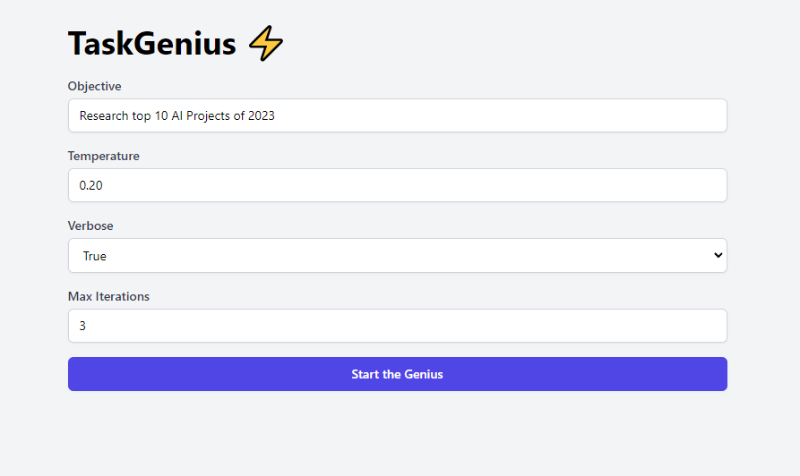

# (mini) AGI TaskGenius GPT - AI-Powered Task Manager and Orchestrator

(mini) AGI TaskGenius GPT is a groundbreaking AI-driven task manager and orchestrator that harnesses advanced natural language processing technology to generate, prioritize, and complete tasks based on user objectives. Inspired by Yohei Nakajima's innovative work on BabyAGI, TaskGenius incorporates a Flask and TailwindCSS UI, offering a seamless experience with OpenAI models. With real-time progress updates and an attractive user interface, TaskGenius is the ultimate solution for managing and automating intricate workflows.



## Features

- AI-fueled task generation, prioritization, and execution
- Live progress tracking via Flask-SocketIO
- Effortless integration with OpenAI models
- Adjustable settings for objectives, temperature, verbosity, and maximum iterations
- Visually engaging user interface utilizing TailwindCSS


## Installation

1. Clone the repository:

```bash
git clone https://github.com/shpetimhaxhiu/agi-taskgenius-gpt.git
```

2. Install the necessary packages:

```bash
pip install -r requirements.txt
```

3. Launch the Flask app:

```bash
python app.py
```

4. Open your browser and navigate to `http://127.0.0.1:5000/` to access the TaskGenius app.

## Usage

1. Input your objective in the "Objective" field.
2. Adjust the temperature, verbosity, and maximum iterations as per your requirements.
3. Click "Run TaskGenius" to initiate the AI-driven task management process.
4. Monitor the real-time progress of task generation, prioritization, and execution in the "Result" section.

## License

This project is licensed under the MIT License - refer to the [LICENSE](LICENSE) file for more information.